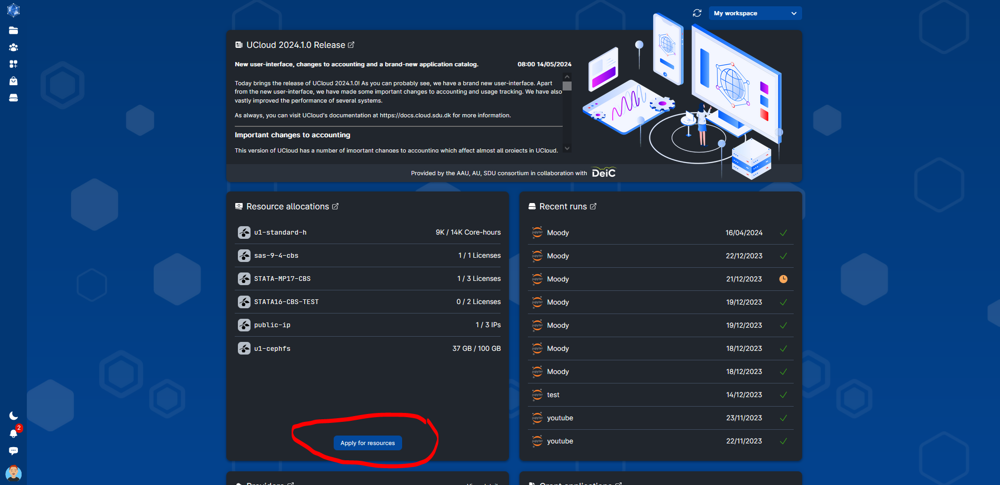
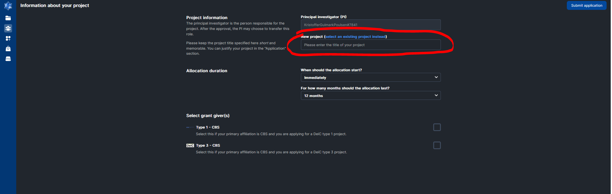
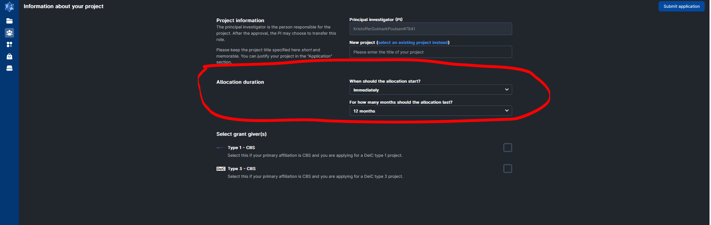
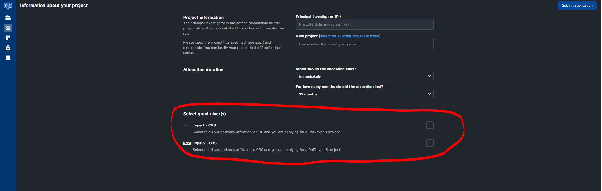
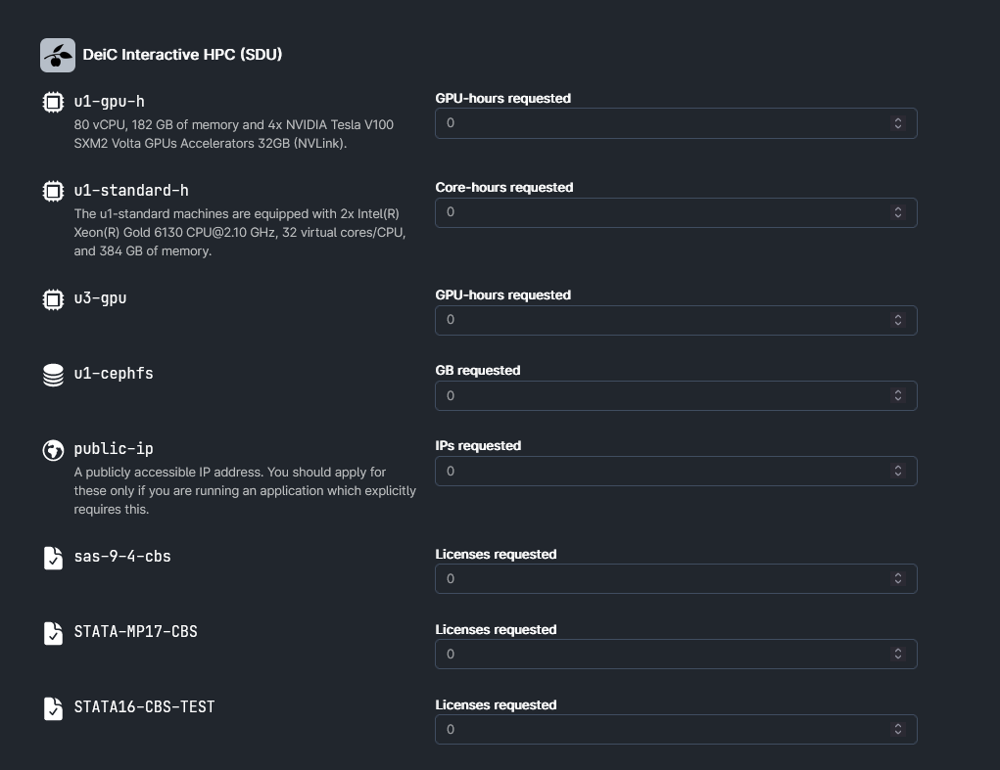
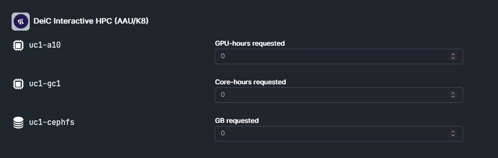

# Applying for ressources in 6 Simple Steps

If you have any further questions you are welcome to contact [RDM Support](/Contact/).

### Step 1: Select "Apply for resources" on the UCloud frontpage 

### Step 2: Select "Apply for new project instead"

### Step 3: Provide a Title and choice HPC type (1 or 3)

### Step 4: Choice Storage amount and Machine Type(in DKK). 
#### Only "DeiC Interactive HPC (SDU) / u1-standard" (CPU) & "DeiC Interactive HPC (AAU) / uc-t4" (GPU) are relevant.

### Step 5: Provide a meaningfull project description & select SAS or STATA License (if needed). 

### Step 6: Press "Submit application"
#### Now the application will be evaluated by the CBS front office at first given opportunity. The application will either be accepted otherwise you will be contacted (CBS mail).

