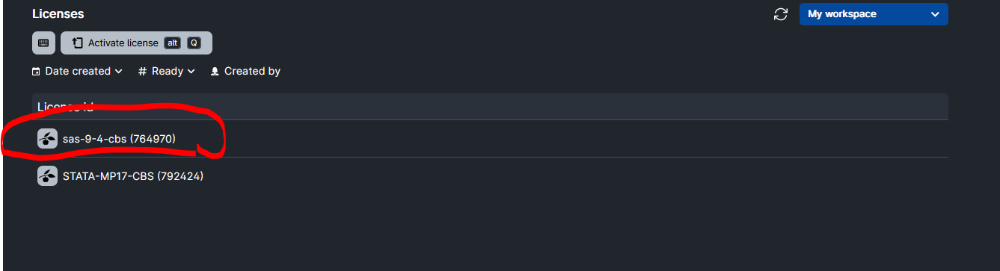

# Add License to Matlab, STATA and SAS application

If you have any further questions you are welcome to contact [RDM Support](/Contact/).

## Add Local License 

### Step 1: Upload local STATA (.lic file) or SAS (.txt file) license to UCloud

### Step 2: Select the license file (.lic or .txt) while setting up UCloud Job

## Add Server License

### Step 1: Apply for Server License through [UCloud Grant Application](/HPC_Facilities/GrantApp/)

### Step 2: Activate License (SAS 9.4 license shown as example)

### Step 3: Select server license while setting up UCloud Job

