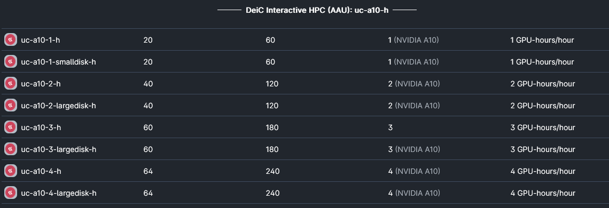

# Type 1 - DeiC Interactive HPC

## DeiC Interactive HPC (SDU)
[SDU](https://cloud.sdu.dk/app/providers/detailed/ucloud) provides **CPU** based containerized applications such as MATLAB, STATA, RStudio, and JupyterLab through a graphical user interface (GUI), in the same way as you would on your laptop. [See all apps](https://docs.cloud.sdu.dk/Apps/type.html). 

**u1-standard**

**The following machines are available:**

**The specification of the largest node (u1-standard-64) are summarized below:**

**Dell PowerEdge C6420**

**CPU:**	64 (32 virtual cores) 2x Intel Xeon Gold 6130 16-Core @ 2.10GHz

**RAM:** 384 GB  DDR 4-2666

**Price:** 5,49 DKK/hour

**Description:** The full node consists of 2x Intel(R) Xeon(R) Gold 6130 CPU@2.10 GHz, 32 virtual cores/CPU, and 384 GB of memory.

## DeiC Interactive HPC (AAU)
[AAU](https://cloud.sdu.dk/app/providers/detailed/aau) provides primary **GPU** based [virtual machines](https://cloud.sdu.dk/app/applications/search?q=Virtual%20Machines). Access is obtained through terminal and [SSH](). It is possible to set up interactive enviroments such as [JupyterLab](https://hpc.ruc.dk/blog/tutorials/setting-up-jupyternotebook-with-gpus-on-aau/).

Four different machine types based on different Nvidia GPUs (T4, A10 , A40 and A100) with different application purposes. 

=== "Nvidia T4"
    - AI Inference: The T4 is optimized for AI inference workloads, making it suitable for applications like image and speech recognition, natural language processing, and recommendation systems in data centers.

    **Nvidia T4 is avaliable on the following machines:**
    
    

    

=== "Nvidia A10"
    - Data Center Workloads: The A10 offers a balance of compute power and memory, making it versatile for various data center tasks, including virtualization, cloud computing, and database acceleration.

     **Nvidia A10 is avaliable on the following machines:**
    
    

=== "Nvidia A40"
    - High-Performance Computing (HPC): The A40 is designed for HPC applications, such as scientific simulations, climate modeling, and molecular dynamics, where high computational power is essential.

    **Nvidia A40 is avaliable on the following machines:**
    
    

=== "Nvidia A100"
    - Deep Learning and AI Research: The A100 excels in deep learning training and AI research, enabling faster model training for tasks like image recognition, natural language understanding, and autonomous driving.
    - High-Performance Computing (HPC): It's also used in HPC environments for tasks like molecular dynamics simulations, quantum chemistry, and climate modeling, thanks to its exceptional computational capabilities.

    **Nvidia A100 is avaliable on the following machines:**
    
    

=== "Specification Comparisons"    

    Their specifications are summarized in a table below.

    | GPU        | Architecture | CUDA Cores | Tensor Cores | Memory      | FP16 (Half) TFLOPS | FP32 (Float) TFLOPS | FP64 (Double) GFLOPS | Data Sheet                                        |
    |------------|--------------|------------|--------------|-------------|--------------------|---------------------|----------------------|---------------------------------------------------|
    | Nvidia T4  | Turing       | 2,560      | 320          | 16 GB GDDR6 | 65.1               | 8.1                 | 254.4                | [T4](https://www.nvidia.com/content/dam/en-zz/Solutions/Data-Center/tesla-t4/t4-tensor-core-datasheet-951643.pdf)  |
    | Nvidia A10 | Ampere       | 6,144      | 384          | 24 GB GDDR6 | 31.2               | 31.2                | 976.3                | [A10](https://www.nvidia.com/content/dam/en-zz/Solutions/Data-Center/a10/pdf/datasheet-new/nvidia-a10-datasheet.pdf)  |
    | Nvidia A40 | Ampere       | 10,240     | 320          | 48 GB GDDR6 | 37.4               | 37.4                | 0.59                 | [A40](https://images.nvidia.com/content/Solutions/data-center/a40/nvidia-a40-datasheet.pdf)  |
    | Nvidia A100| Ampere       | 6,912      | 432          | 80 GB HBM2  | 78.0               | 19.5                | 9700                 | [A100](https://www.nvidia.com/content/dam/en-zz/Solutions/Data-Center/a100/pdf/nvidia-a100-datasheet-nvidia-us-2188504-web.pdf)  |

    - **CUDA cores** are the general-purpose processing units in a GPU that can perform computations with standard floating-point precision, such as single-precision (32-bit) or double-precision (64-bit).

    - **Tensor Cores** are optimized to trade off precision for speed and can significantly accelerate deep learning training and inference.

    - A more detailed description can be found [here](https://medium.com/@primedeviation/cuda-vs-tensor-cores-a-guide-for-ml-workloads-and-model-training-1756bedd5f03).
