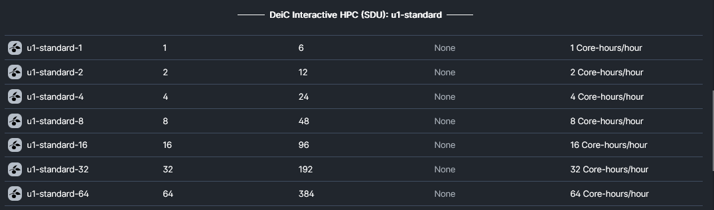
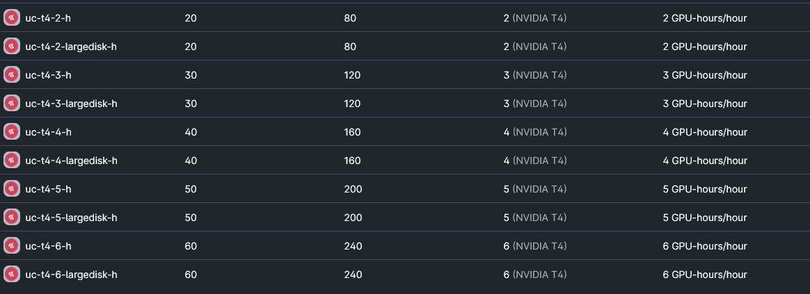

# Type 1 - DeiC Interactive HPC

Find more information [here](https://escience.sdu.dk/index.php/ucloud-yougene-cluster/).

## DeiC Interactive HPC (SDU) / u1-standard (CPU)
[SDU](https://cloud.sdu.dk/app/providers/detailed/ucloud) provides **CPU** based containerized applications such as MATLAB, STATA, RStudio, and JupyterLab through a graphical user interface (GUI), in the same way as you would on your laptop. [See all apps](https://docs.cloud.sdu.dk/Apps/type.html). 

**The following machines are available:**

### u1-standard-64 Specs

**Dell PowerEdge C6420**

**vCPU:**	64 (32 virtual cores) 2x Intel Xeon Gold 6130 16-Core @ 2.10GHz

**RAM:** 384 GB  DDR 4-2666

**Price:** 5,49 DKK/hour

**Description:** The full node consists of 2x Intel(R) Xeon(R) Gold 6130 CPU@2.10 GHz, 32 virtual cores/CPU, and 384 GB of memory.

## DeiC Interactive HPC (AAU) / uc-t4 (GPU)
[AAU](https://cloud.sdu.dk/app/providers/detailed/aau) provides primary **GPU** based [virtual machines](https://cloud.sdu.dk/app/applications/search?q=Virtual%20Machines). Access is obtained through terminal and [SSH](). It is possible to set up interactive enviroments such as [JupyterLab](https://hpc.ruc.dk/blog/tutorials/setting-up-jupyternotebook-with-gpus-on-aau/).

**The following machines are available:**

### uc-t4-6 Specs

**vCPU:**	60 cores

**RAM:** 240 GB

**GPU:**    6 (NVIDIA T4)

**Storage:**  10 TB

**Price:**	50,94 DKK/hour

**Description:**		Virtual machine with 6 NVIDIA T4 GPUs deployed and 10TB of storage on the AAU OpenStack system.
